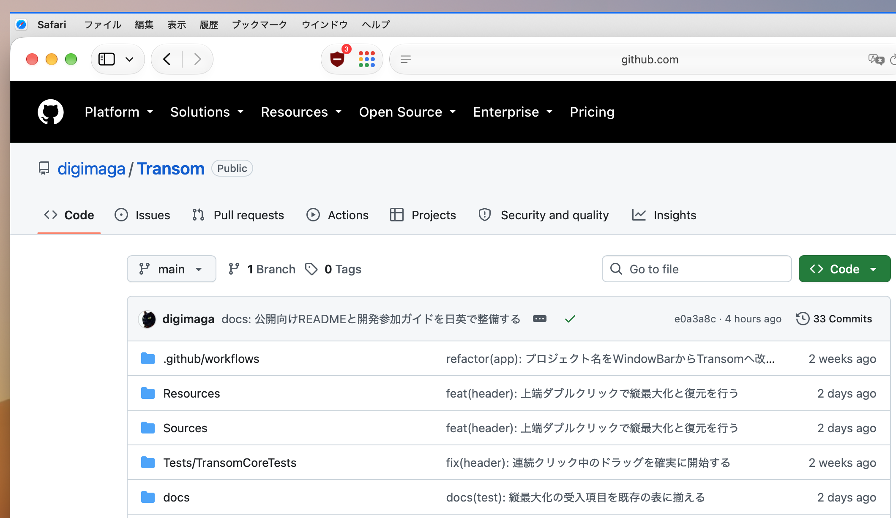

English | [日本語](README.ja.md)

# Transom

**Windows-style window controls and app menus, right above your Mac windows.**

Transom is a menu-bar app that adds a separate title bar above ordinary macOS windows. It brings the app menu, minimize, maximize, and close controls to each window while keeping the original macOS menu bar, window buttons, and toolbar available. The bar shows the app name and menus; window titles appear in tooltips.

The name comes from the small window above a door or window: a *transom*.

**Development preview · 0.1.0-dev · MIT license.** Build from source using the steps below. Compatibility depends on the app and macOS version; there is no Apple-notarized release. See [verification status](#verification-status) before using it with important work.

## Screenshot



*Appearance reference: Safari with Transom, captured on 2026-10-04. Appearance may vary with settings and macOS version.*

## Features

- **Menus next to each window.** Open the app menu, File, Edit, and other menus through native macOS menus. Narrow bars collect extra menus under `»`.
- **Window controls on the right.** Minimize, maximize/restore, and close. Maximize leaves room for the external bar instead of entering native full screen.
- **Drag and double-click.** Drag empty bar space to move the window. Double-click it to maximize/restore; double-click its top 5 points to maximize vertically while keeping the width and horizontal position.
- **Window context menu.** Right-click the bar for window controls, reserving space above that window, or excluding its app.
- **Appearance settings.** Choose the bar color, active-window accent, line or fill style, line thickness, and bar height from the **TR** menu.
- **Per-app exclusions and optional launch at login.** Manage both from **TR**. The interface follows the macOS language setting, with Japanese and English support.

## Requirements

| Item | Requirement |
| --- | --- |
| macOS | Build target: macOS 14 or later. Recorded hardware testing covers specific scenarios on macOS 26 and 27.0.1, not every supported OS. |
| Hardware | Hardware verification was performed on Apple Silicon. Intel Macs have not been verified. |
| Build tools | Swift 6 toolchain from Xcode or compatible Command Line Tools. The project uses Swift 5 language mode. |
| Permission | Accessibility access for the built `Transom.app`. |

There are no external Swift package dependencies. Homebrew and XcodeGen are not required.

## Build and run

Clone this repository, or download and extract its source ZIP. From Terminal:

```bash
git clone https://github.com/digimaga/Transom.git
cd Transom
bash scripts/build-app.sh --release
open dist/Transom.app
```

If you downloaded the ZIP, open Terminal in the extracted `Transom` folder and start with the build command.

1. Find **TR** in the macOS menu bar.
2. Allow **Transom** in **System Settings → Privacy & Security → Accessibility**, then restart Transom if the bars do not appear.
3. Move an ordinary window down to leave about 40 points below the menu bar. The default external bar is 30 points high and needs room above the window.

Alternatively, choose **TR → Reserve Bar Space on Frontmost Window**. This explicitly moves, and if needed shrinks, just that window. Transom does not rearrange windows automatically at launch. Window movement and resizing also occur when you use its drag, maximize, or restore controls.

The build writes `dist/Transom.app`; it does not install into `/Applications` or enable launch at login. Use a fixed app location. If you move or rebuild it, check Accessibility permission for the copy you actually launch.

### Signing and updates

The build script uses a certificate named `Transom` from the keychain when available; otherwise it applies an ad-hoc signature. The script does not perform Apple notarization. No signing keys or certificates are included. Set `CODESIGN_IDENTITY` if you need a particular signing identity (`-` selects ad-hoc signing).

Quit Transom from **TR** before replacing or rebuilding the app. Signature changes can require granting Accessibility permission again. To stop using it, quit the app; disable **Launch at Login** first if you enabled it.

## Permissions and privacy

Accessibility access lets Transom read window and menu information and perform the actions you select in other apps, including saving or closing documents. Those actions are handled by the target app and can change its data.

- Window titles, available document URLs, menu labels, and selection context are used in memory to identify and validate the target. Window titles can appear in the bar's tooltip.
- Transom has no app network communication or analytics. It does not request Screen Recording or Input Monitoring, record keystrokes, disable SIP, or inject code into other apps.
- Appearance settings, enabled state, and excluded app identifiers are stored locally in macOS preferences. Runtime logs record status, numeric window IDs, and timing; they do not include document names, document URLs, menu labels, or selected text.
- **TR → Copy Diagnostics (No Document Names)** copies version, OS, permission/capability flags, and counts to your clipboard. Nothing is uploaded automatically. Review the contents before sharing them.

## Known limitations

- Native full-screen windows, sheets, modal dialogs, and windows smaller than 280 points wide or 120 points high are excluded.
- If there is not enough vertical room for the bar, it stays hidden instead of covering the original controls or content. Windows extending sideways or downward off-screen can keep their bars; the off-screen portion is clipped. Multiple-display behavior still needs hardware testing.
- Menus depend on what each app exposes through Accessibility. Lazily generated menus, custom controls, and Option-key alternatives may be unavailable. Use the original macOS menu for those items.
- An action is refused if Transom cannot verify the exact window, focus, or menu context. It does not guess by title or automatically retry a command with an uncertain result.
- Spaces support follows the windows currently visible. The bar is a separate window, so unified animations with Mission Control, Stage Manager, or Space transitions are not guaranteed.
- Exact window identification uses a private macOS API through `TransomBridge`. OS updates can break compatibility. This is not a Mac App Store build.
- Maximize/restore depends on the target app's size constraints. Restore frames are kept only while Transom is running and the window remains tracked.

## Troubleshooting

| Symptom | First checks |
| --- | --- |
| No bars | Check Accessibility permission for the launched app, the enabled setting in TR, app exclusions, and free space above a normal window. |
| A menu is missing or an action is refused | Try the original macOS menu. Collect Transom diagnostics and a minimal reproduction using a test document. |
| Permission stops working after rebuilding | Quit the old app, check the current app's location and Accessibility entry, then launch that copy again. |
| Build fails | Confirm `xcrun swift --version` reports Swift 6 or later and that the selected Xcode/Command Line Tools installation is usable. Include the first build error in a report. |

For reports, see [contributing and bug reports](CONTRIBUTING.md). Remove personal data from logs and screenshots before posting.

## Verification status

The latest recorded local verification, on **2026-10-02**, passed **44 tests across 7 suites**, built both apps, and checked specific GUI scenarios on macOS 27.0.1 / Apple Silicon. Earlier records cover additional scenarios on macOS 26. These are results for the recorded environments and actions, not a guarantee for every app or OS.

Multiple displays, Intel hardware, and a complete acceptance rerun on macOS 27 remain unverified. See the dated [validation records](docs/VALIDATION.md) and [acceptance checklist](docs/ACCEPTANCE.md) for individual results. `BUILD_STATUS.json` is the historical 2026-09-16 build snapshot, not the current compatibility summary.

## Development

```bash
# Build both apps, run common-logic tests, and check source/configuration.
bash scripts/verify.sh

# Build the separate app used for manual window/menu verification.
bash scripts/build-app.sh --lab
open dist/TransomLab.app
```

TransomLab creates test windows. Its **verification save** command writes fixture files and an event log under `~/Library/Application Support/TransomLab/`. It is a separate app and is not included in the normal Transom bundle.

CI builds and unit tests do not exercise live Accessibility, focus, or Spaces. Use the [acceptance checklist](docs/ACCEPTANCE.md) for hardware testing, and distinguish new observations from earlier records.

- [Contributing and bug reports / 開発参加・不具合報告](CONTRIBUTING.md)
- [Architecture](docs/ARCHITECTURE.md), [development handoff](docs/HANDOFF.md), and [review notes](docs/REVIEW.md) — Japanese developer documents, including historical notes.
- [Agent development rules](AGENTS.md)

## License

[MIT](LICENSE). API references and prior projects consulted during development are listed in [Sources](docs/SOURCES.md).
